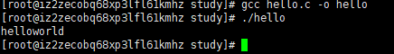
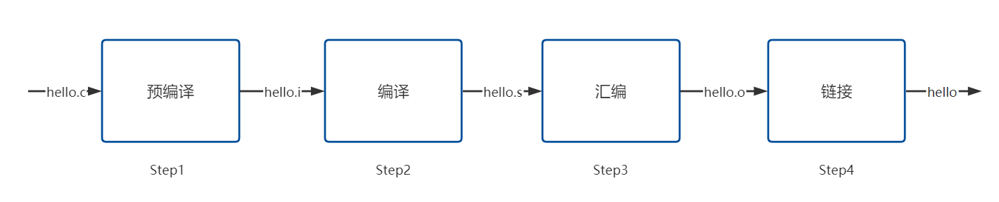
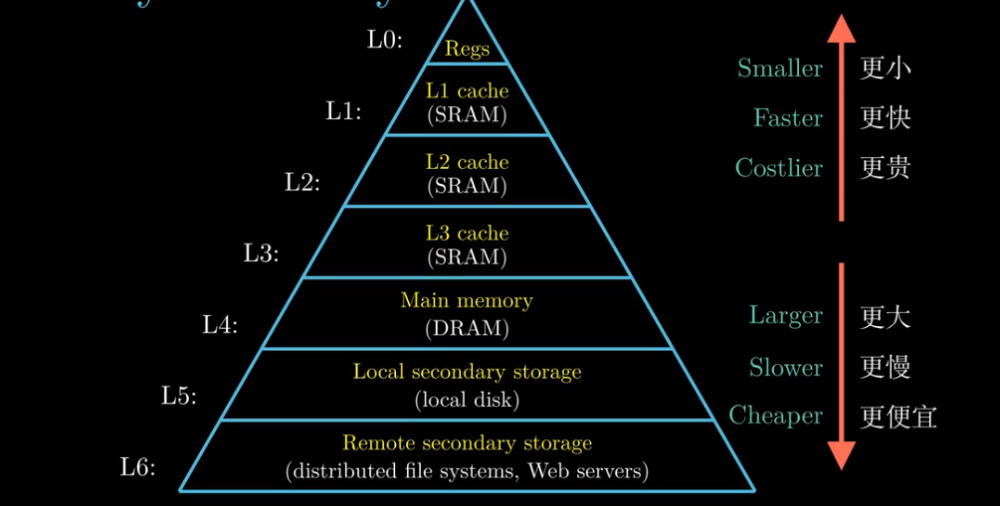
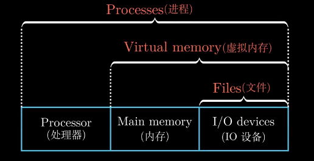
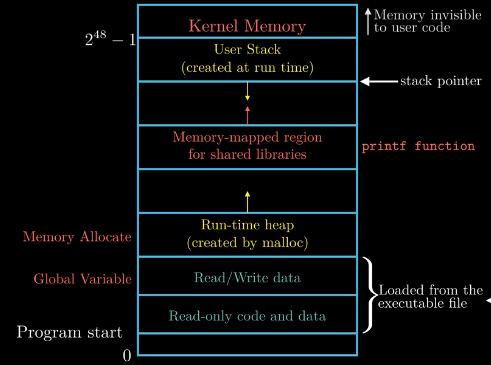

# 计算机系统漫游

### 1 The Life of HelloWorld

打开Linux，使用Vim编辑器编写HelloWorld

```bash
vim hello.c
```

```c
#include "stdio.h"
int main()
{
    printf("helloworld\r\n");
    return 0;
}
```

将编写完成的hello.c用gcc编译器进行编译，生成可执行文件**hello**

```bash
gcc hello.c -o hello
```

执行可执行文件hello

```shell
./ hello
```

我们可以看到如下结果




实际上从hello.c到hello过程十分复杂，但大致上可以分为4个步骤：



**预编译：**

1.#define宏展开

2.处理预编译指令，例如#if、#elif、#else、#endif等

3.处理所有#include，将被包含的头文件添加到#include指令位置。

4.删除注释

5.保留#pragma编译指令

```bash
gcc -E hello.c -o hello.i
```

**编译：**

1.扫描，语法分析、语义分析、源代码优化，目标代码生成，目标代码优化

2.生成汇编代码

```bash
gcc -s hello.i -o hello.s
```

**汇编：**

1.汇编器根据指令集将hello.s翻译成机器指令，并按照一定顺序打包，生成**可重定位文件**hello.o

```bash
gcc -c hello.s -o hello.o
```

**链接：**

1.hello.c中调用了printf函数，而printf在printf.o中。Linker则会将hello.o和printf.o进行合并

2.生成可执行文件hello

```bash
gcc hello.o -o hello
```

***

### 2 Cache

对于CPU而言，访问寄存器、Cache、内存、磁盘、远程存储的速率是不同的。但是越快的速率也意味着更贵的价格。



### 3 OS

操作系统对硬件资源抽象化，提供统一接口给应用程序。所以操作系统抽象出了几个概念：



虚拟内存空间：



### 4 Concurrency and Parallelism

1.Thread-Level Concurrency

超线程技术：备份PC、Reg文件等（浮点运算不备份，共享）。对比普通CPU，线程切换速度很快。当某一线程需要等待缓冲数据到内存时，便可以先切换线程。

2.Instruction-Level Parallelism

流水线技术

3.Single-Instruction Multiple-Data Parallelism

SIMD的指令多是为了提高视频、音频这类数据的执行速度。